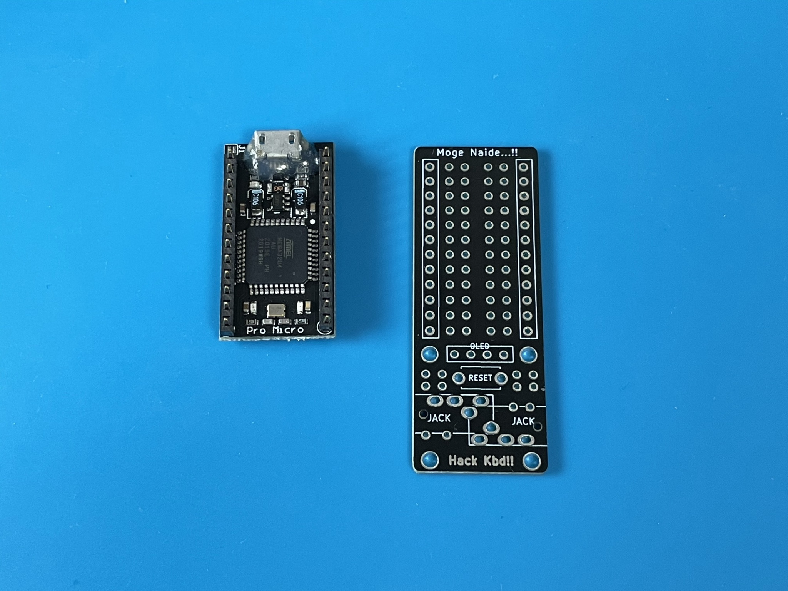

# earth-rover とは？

<figure>

</figure>

[無限の可能性](https://github.com/swanmatch/MxLEDBitPCB)から生まれた機械生命体です。
普段はマクロパッドに擬態して人間と共生しています。

<!-- 名前の由来は火星探査機(Mars rover)からです。1号機完成後の見た目がなんとなくNASAの火星探査機を思い起こさせるずんぐりむっくりであったため、地球にいるこいつは地球探査機 = earth-roverと名付けました。 -->

# ビルドガイド

一度自作キーボードを作ったことがある人を想定して書いています。
初めての作成でもできなくないかもしれませんが特に道具などの使い方について詳しくないためより丁寧な説明が書かれている[Claw44ビルドガイド \| yfuku docs](https://yfuku.com/claw44/buildguide/)などを参考にしてください。

また、立体的な配線と空中配線からハンダ付けの難易度は少し高めです。

## 構成要素

| 名前 | 数 | 備考 |
|:-|:-|:-|
| 無限の可能性(以下のどれか1つ) | | |
| 1. [無限の可能性『ConTaiNeR』\(kailhソケット版\) \- 魔界鍵盤製作所 \- BOOTH](https://swanmatch.booth.pm/items/1940367) | 1枚(14セル) | [スイッチ用PCBソケット（10個入り） \| 遊舎工房](https://yushakobo.jp/shop/a01ps/)(MX用)も14個必要 |
| 2. [無限の可能性『SuXeN』 \- 魔界鍵盤製作所 \- BOOTH](https://swanmatch.booth.pm/items/1940247) | 1枚(14セル) | |
| 3. [Chocっとした可能性\(ロープロ挟ピッチ版\) \- 魔界鍵盤製作所 \- BOOTH](https://swanmatch.booth.pm/items/1940394) | 1枚(18セル) | これを使用する場合は以下14個を18個へ適時読み替えてください|
| [ProMicroSocket\(プロマイクロのおうち\) \- 魔界鍵盤製作所 \- BOOTH](https://swanmatch.booth.pm/items/1073313) | 1個 | |
| [Pro Micro （コンスルー付き） \| 遊舎工房](https://yushakobo.jp/shop/promicro-spring-pinheader/) | 1個 | |
| [【保守部品】タクタイルスイッチ \| 遊舎工房](https://yushakobo.jp/shop/a0800ts-01-1/) | 1個 | |
| [【保守部品】ダイオード　リードタイプ（100個入り） \| 遊舎工房](https://yushakobo.jp/shop/a0800di-01-100/) | 14本 | |
| キースイッチ | 14個 | 選択した無限の可能性に合わせてMX互換またはchoc互換のものを選んでください |
| キーキャップ | 1u 14個 | |
| エナメル線またはリード線 | | |

MX用とChoc用のどちらの無限の可能性でも作成できますが、全長がProMicroSocket依存なのでChoc用のほうが小さいわけではないです。
むしろChoc用のほうがぎりぎり収まらないために全長がMX用より長くなっています(ProMicroSocketの不要部分を切る、あるいはProMcroへ直接配線するなどでより小さく作ることは可能ですが、配線やファームウェアなどの調整が必要になります)。

## 育成方法

### 外骨格の作成

無限の可能性からearth-roverの外骨格を作ります。

まず無限の可能性の方向を自分と正対するように目の前に置きます(文字が自然に読める方向 & ダイオードのアイコンが手前側です)。
次に以下の部分をニッパーで切ってください。

<figure>
<figcaption>ConTaiNeRまたはSuXeNの場合</figcaption>

</figure>

<figure>
<figcaption>Chocっとした可能性の場合</figcaption>

</figure>

※ 別の切り方もできますがダイオードの方向が変わってくるためこの後説明しやすい切り方にしています

最後にニッパーで切ったときにできた尖った部分を棒ヤスリなどでなめらかにしましょう(僕は[これ](https://www.amazon.co.jp/dp/B00FPJH02C)を使っています)。earth-roverは文字通り外骨格が外部に露出しているため尖った部分が残っていると指を切る可能性があります。
棒ヤスリがない場合はニッパーでなるべくギリギリまで切ってから紙やすりでなめらかにしましょう(あれば)。

<figure>
<figcaption>ヤスリがけ前の状態</figcaption>

</figure>

<figure>
<figcaption>最終的な外骨格1セット</figcaption>

</figure>

### 神経節の取り付け

ダイオードを外骨格へ取り付けます。

|  |  |
| ---- | ---- |
| ダイオードの足を折ります。ベンダーがあると便利です。 | ダイオードを外骨格上へ仮止めします。マスキングテープがあると便利です |
|  |  |
| 裏から見るとこんな感じ | はんだ付けを行いニッパーで余分な足を切ります。このとき切った足は後で使いますので残しておきましょう。 |

### (ConTaiNeRのみ) 鱗の根っこを付ける

無限の可能性ConTaiNeRを使用している人はここで[スイッチ用PCBソケット（10個入り） \| 遊舎工房](https://yushakobo.jp/shop/a01ps/)を付けます。
ソケットには上下があるのでシルクに合わせて取り付けましょう。

<figure>

</figure>

PCBソケットははんだ付けがしやすい反面、見た目でハンダされているかが分かりづらかったりハンダされていなくても通電することがあるので後になって接触不良による動作不良の原因になりやすいです。
このタイミングで以下の点を確認しましょう。

1. 浮いているソケットがないこと
2. ハンダされていない足がないこと
3. 向きが間違っているソケットがないこと

### 脳みそと頭蓋骨の組み立て

脳みそであるPro Microと頭蓋骨であるProMicroSocket(プロマイクロのおうち)を組み立てます。

|  |  |  |
| ---- | ---- | ---- |
| Pro Micro 1つとコンスルー(12ピン) 2つを用意します | 向きに注意しつつ組み立てます。接着剤を使ってMicro USBのコネクタ部分を補強するとGood| その際は接着剤がコネクタ内部に入り込まないように注意します。|
|  |  |  |
| ProMicroSocketへ問題なく取り付けられるか確認します | ちなみに取り付けるときの向きはRESETピンの位置で合わせるとやりやすいです| 今後のはんだ付けのために一旦ProMicroSocketからPro Microを取り外します|
|  |  |  |
| ProMicroSocketへタクタイルスイッチを仮どめします。その際ProMicroSocketの表裏に注意してください| このように裏面へ足が出るまできっちり押し込んでください| 穴が埋まる程度にハンダ付けします|

### 神経接続

earth-roverの神経であるリード線を接続します。

|  |  |
| ---- | ---- |
| 短いところはダイオードの切断した足、長いところはエナメル線またはリード線で接続すると楽です | このように側面の外骨格側へまずハンダ付けを行い、
|  | |
| このように上面の外骨格へ指してハンダ付けを行うのがおすすめです。この際外骨格同士が直角になるギリギリの長さでハンダ付けを行うと完成時格好良くなります | |
|  |  |
| 外骨格の神経を接続した姿その1 | 外骨格の神経を接続した姿その2 |
|  |  |
| 引き続き外骨格と頭蓋骨も接続します。ここの接続はある程度遊びが必要であるため10cm程度の線を使ってください。 | 最終的にこうなります。この時点では頭蓋骨がはみ出ていてもOK

### 頭蓋骨を外骨格へ固定

|  |  |
| ---- | ---- |
| 10cmぐらいのエナメル線またはタコ糸などの絶縁コードを用意 | 作成したコードを画像の丸の部分へくくりつけて結ぶ|
|  |  |
| 結んだコードをペンチなどでひねり、Pro Microを基板へ固定する | あまり締めすぎるとキースイッチを入れにくくなるためそこそこでOK(画像は締めすぎて外骨格前面と接近しすぎたせいでキースイッチが入らなくなった悪い例)|

### 鱗の貼り付け

earth-roverの鱗であるキースイッチとキーキャップを取り付けます。

<figure>

</figure>

### 人格のインストール

USB接続で脳みそへqmk firmwareベースの人格をインストールします。

TBW

### 完成

お疲れ様でした、これでearth-roverの完成です！

<figure>

</figure>
